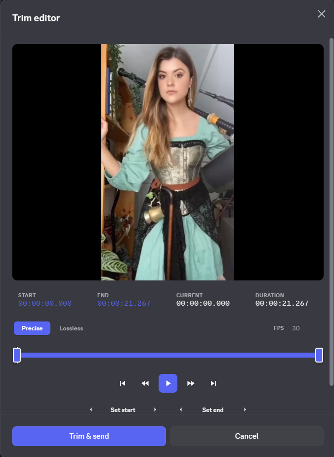
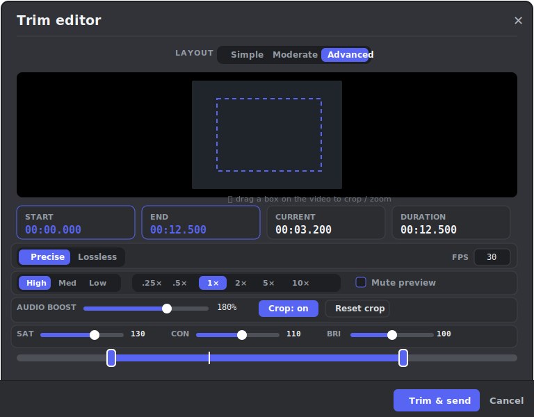
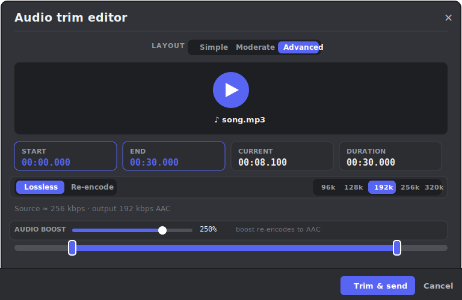
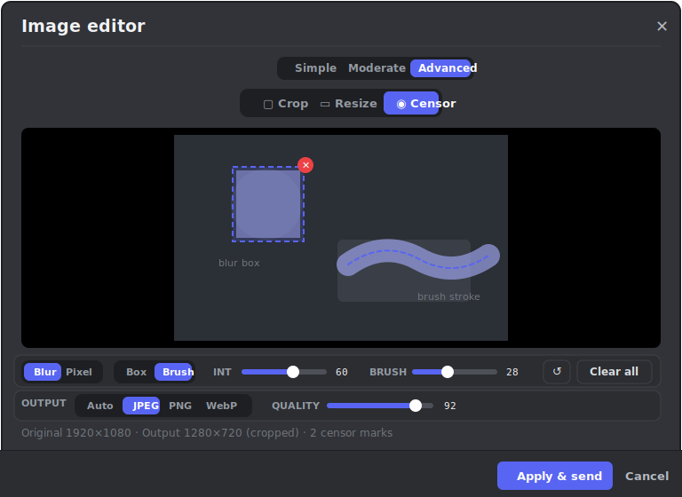

<div align="center">

# ✂️ Clipify

**Edit your media before sending it — without ever leaving Discord.**

A [Vencord](https://vencord.dev/) / [Equicord](https://equicord.org/) userplugin that intercepts **video, audio and image** uploads, asks whether you want to edit, and opens a polished editor built right into the client: a frame-accurate video trimmer, an audio cutter, and a mini image editor with crop, resize and censor tools.

[](https://vencord.dev/)
[](https://equicord.org/)
[](#license)
[](https://github.com/ffmpegwasm/ffmpeg.wasm)

</div>

---

## Overview

Drop, paste, or attach a **video, audio clip or image** in any channel or DM and Clipify steps in **before** it reaches the composer. Decide in one click whether to send the file as-is or open the matching editor.

Everything runs **locally in your client**. Your media is never uploaded to any third-party service.

<div align="center">

| Choice prompt | Trim editor |
| :-----------: | :---------: |
|  |  |

</div>

### The editors

> Interface mockups of each editor in **Advanced** layout.

<div align="center">







</div>

## Features

- **🎬 Video — frame-accurate trimmer** — scrub the timeline, set in/out points, step a single frame at a time, and preview your exact selection. Two engines (see [comparison](#video-engines)) and High / Medium / Low quality presets. **Advanced** adds **color grading** (saturation / contrast / brightness, previewed live), an **audio boost**, and a **crop / zoom** box you drag right on the video.
- **🎵 Audio — quick cutter** — trim an audio clip down to the part you want with the same timeline + in/out workflow. Lossless cut (keeps the original format) or re-encode, with a fully-offline WAV fallback. Shows the source **bitrate in kbps**, and **advanced** adds an output bitrate picker and an **audio boost** (gain).
- **🖼️ Image — mini editor** — three tools in one modal:
  - **Crop** — drag a selection box; everything outside it is dimmed.
  - **Resize** — set width / height with an optional aspect-ratio lock.
  - **Censor** — hide faces, text or anything sensitive with **blur** or **pixelate (mosaic)**. Draw **boxes** or free-hand **paint with the brush**, with sliders for intensity and brush size, plus undo / clear.
- **🧰 Three layout modes** — a **Simple / Moderate / Advanced** switch in every editor reveals progressively more controls, from the bare essentials up to the power-user effects. See [Layout modes](#layout-modes) for the full breakdown.
- **⏯️ Cancellable exports** with live progress.
- **🔒 Local-only & private** — no telemetry, no uploads. Images are edited purely on a canvas; the only network request is a one-time fetch of the FFmpeg core (see [notes](#notes--privacy)).
- **🎚️ Per-type opt-in** — audio and image interception can each be toggled off in settings.

## Layout modes

Every editor has a **Simple / Moderate / Advanced** switch at the top (the default is set in settings, but you can change it live per session). Each step up reveals more controls without changing what you already set — they're purely about how much is on screen.

- **Simple** — just the essentials to get the job done fast.
- **Moderate** — the standard toolset (the default).
- **Advanced** — everything, plus the power-user effects.

What each mode shows, per editor:

| Editor | Simple | Moderate *(adds)* | Advanced *(adds)* |
| --- | --- | --- | --- |
| **🎬 Video** | Timeline, play, trim & send | Frame-by-frame nav, set in/out points, FPS, Precise/Lossless mode | Output quality, **speed 0.25×–10×**, mute preview, **color grading** (saturation/contrast/brightness), **crop / zoom**, **audio boost** |
| **🎵 Audio** | Timeline, play, trim & send | Lossless/Re-encode mode, set in/out points, source **bitrate (kbps)** | Output AAC **bitrate** picker, **audio boost** (gain) |
| **🖼️ Image** | Crop, resize (W/H + lock), censor with **blur boxes** + intensity | **Pixelate** style, **brush** painting + brush size, undo | Output **format** (PNG/JPEG/WebP) + **quality**, resize **scale presets** (25/50/100%) |

> Advanced effects on video/audio (color grading, crop, boost, speed) re-encode through FFmpeg automatically — they can't be applied to a lossless stream copy.

## Video engines

| | **FFmpeg** *(recommended)* | **MediaRecorder** |
| --- | --- | --- |
| **How** | `ffmpeg.wasm` running in-client | Browser-native real-time re-encode |
| **Precise mode** | ✅ Exact-frame cut, re-encoded to `.mp4` | ✅ Frame-accurate |
| **Lossless mode** | ✅ Instant stream-copy, zero quality loss¹ | ❌ |
| **Output** | `.mp4` (precise) / original container (lossless) | `.webm` |
| **Speed** | Fast; lossless is near-instant | Real-time (a 30s clip takes ~30s) |
| **Network** | One-time ~30 MB core download² | None — fully offline |

> ¹ In lossless mode the start point snaps to the nearest preceding keyframe (a fundamental trade-off of stream-copying).
> ² The core is fetched from [jsDelivr](https://www.jsdelivr.com/), which is allow-listed in Discord's CSP. Cached by the browser after first use.

Audio trimming follows the same engine setting: **FFmpeg** does a lossless stream-copy (or re-encodes to AAC `.m4a`), while **MediaRecorder** / any ffmpeg failure falls back to a lossless **WAV** export — both fully offline. Image editing never needs ffmpeg.

## Keyboard shortcuts

Available in the **video** and **audio** editors:

| Key | Video | Audio |
| --- | --- | --- |
| <kbd>Space</kbd> | Play / pause selection | Play / pause selection |
| <kbd>←</kbd> / <kbd>→</kbd> | Step 1 frame | Seek 1 second |
| <kbd>Shift</kbd> + <kbd>←</kbd> / <kbd>→</kbd> | Jump 10 frames | Seek 5 seconds |
| <kbd>I</kbd> / <kbd>O</kbd> | Set in / out point | Set in / out point |
| <kbd>Home</kbd> / <kbd>End</kbd> | Jump to selection edges | Jump to selection edges |

## Configuration

Configure under **Settings → Plugins → Clipify**.

| Setting | Default | Description |
| --- | --- | --- |
| **Intercept uploads** | On | Ask before sending a media upload. |
| **Edit audio** | On | Also intercept audio uploads (trim before sending). |
| **Edit images** | On | Also intercept image uploads (resize / crop / censor). |
| **Engine** | FFmpeg | Video/audio engine — FFmpeg or MediaRecorder (offline). |
| **Trim mode** | Precise | FFmpeg only — *Precise* (exact frame, re-encodes) or *Fast* (lossless keyframe). |
| **Export quality** | High | High / Medium / Low (CRF for FFmpeg precise, bitrate for MediaRecorder). |
| **Frame rate** | 30 | Assumed FPS used for frame-by-frame navigation in the video editor. |
| **Layout** | Moderate | Default editor layout — Simple, Moderate or Advanced. Switchable live inside each editor. |

## Supported input formats

- **Video** — `mp4` · `webm` · `mov` · `mkv` · `avi` · `m4v` · `mpg` · `mpeg` · `wmv` · `flv` · `ts` · `3gp` · `ogv`
- **Audio** — `mp3` · `wav` · `ogg` · `oga` · `m4a` · `aac` · `flac` · `opus` · `weba` · `wma` · `aiff` · `aif`
- **Image** — `png` · `jpg` · `jpeg` · `webp` · `bmp` · `avif`  *(animated GIFs are left untouched to preserve animation)*

Detection prefers the file's MIME type and falls back to the extension, so pasted blobs without a MIME type are still recognised.

## Installation

Clipify is a **userplugin** and requires a development build of Vencord or Equicord.

1. Clone this repository into your client's userplugins directory:
   ```bash
   git clone https://github.com/Overocai/Clipify.git src/userplugins/Clipify
   ```
2. Rebuild and inject the client:
   ```bash
   pnpm build && pnpm inject
   ```
3. Restart Discord and enable **Clipify** under **Settings → Plugins**.

> New to custom plugins? See the official guide: [Installing custom plugins](https://docs.vencord.dev/installing/custom-plugins/).

## Notes & privacy

- **No uploads.** All editing happens in your client. Clipify never sends your media to a third-party server.
- **The single network request** is a one-time download of the FFmpeg WebAssembly core from jsDelivr, only when you first use the FFmpeg engine for video or audio. Image editing and the WAV audio fallback are fully offline.
- Only the **first** supported file in a multi-file drop is opened in an editor; everything else in the same drop is forwarded to Discord's normal upload flow unchanged.

## License

Released under the **[GPL-3.0-or-later](https://www.gnu.org/licenses/gpl-3.0.html)** license.

<div align="center">

Made with ✂️ by [**overocai**](https://github.com/Overocai)

</div>
