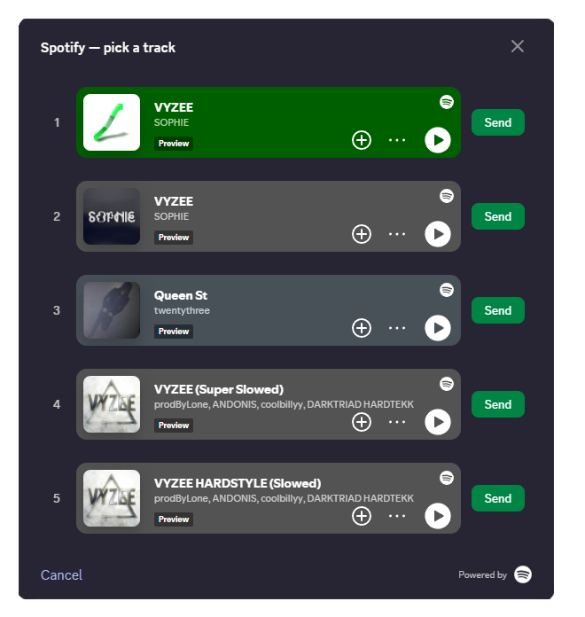

# SpotifySearch

A Vencord plugin that adds `/spotify` to search Spotify and share tracks right from Discord.

Type the command, get a list of 5 matches, listen to a 30-sec preview if you want, click Send — Discord turns the link into a player.

[](./LICENSE)
[](https://github.com/Vendicated/Vencord)
[](https://developer.spotify.com/documentation/web-api)

## What you need

- Node.js, pnpm, git.
- A Spotify app — create one at https://developer.spotify.com/dashboard. You'll get a Client ID and Client Secret.
- **Spotify Premium** on the account that owns the app — required for Web API access since Feb 2026. No way around it. (You can register the app on a free account, but API requests will return 403 until Premium is active.)

## Screenshots

The modal with 5 search results and embedded Spotify players:



## Step 1 — Install Vencord (skip if you already have it)

If you don't have a local Vencord Dev Build yet, set it up first:

```sh
git clone https://github.com/Vendicated/Vencord
cd Vencord
pnpm install
```

Full official guide: https://docs.vencord.dev/installing/

## Step 2 — Add the plugin

Drop the `SpotifySearch` folder (with everything inside, including `logo/`) into Vencord's userplugins directory. The final path must look like this:

```
Vencord/src/userplugins/SpotifySearch/
```

(Don't unpack the contents into `userplugins/` directly — keep them inside the `SpotifySearch` folder.)

## Step 3 — Build and load

The order matters — `inject` copies the freshly built files into Discord, so you need to build first and have Discord closed when injecting:

```sh
pnpm build
```

Then **fully quit Discord** — right-click the tray icon → Quit Discord. Just closing the window doesn't count.

```sh
pnpm inject
```

Open Discord again. Plugin should be loaded.

## Step 4 — Configure

1. Discord → User Settings → Vencord → Plugins.
2. Find **SpotifySearch**, turn it on.
3. Click the gear icon, paste your Client ID and Client Secret (from the Spotify Dashboard).

Done. Try `/spotify query: songname` in any channel.

## Disclaimer

This plugin uses the Spotify Web API. It's not affiliated with or endorsed by Spotify AB.

- Your search queries go to Spotify's servers.
- You bring your own Spotify app credentials.
- You're agreeing to [Spotify's Developer Terms](https://developer.spotify.com/terms).
- Track data, artwork, and previews belong to their rights holders.

The plugin only does anything when you type the slash command. No background stuff, no automation.

"Spotify" and the Spotify logo are trademarks of Spotify AB. The logo and embed player are here purely for attribution under [Spotify's Design Guidelines](https://developer.spotify.com/documentation/design).

## Privacy

- Client ID and Secret sit in Vencord's `settings.json` as plain text. Don't share that file.
- Auth and search requests go through the Electron main process, not the Discord renderer — so the access token doesn't leak to other plugins.
- The embed players load from `open.spotify.com` inside the modal. Spotify's normal cookies and policies apply to those.

## Troubleshooting

**Command doesn't show up**
Plugin's not enabled, or you didn't quit Discord fully before re-injecting. Quit from tray, not just close.

**`Failed to fetch`**
Native module didn't load. Redo the steps: `pnpm build` → quit Discord → `pnpm inject` → open Discord.

**`auth failed: 400` / `401`**
Wrong Client ID or Secret. Re-copy from the Spotify dashboard.

**`403 Active premium subscription required`**
The account that owns the Spotify app needs Premium. No workaround.

**`No loader is configured for ".png"`**
Your Vencord is too old for `file://...?base64` imports. Update to latest Dev Build.

**Embed player is blank**
Discord might be blocking `open.spotify.com` iframes via CSP. Open DevTools (Ctrl+Shift+I) → Console for the actual error, open an issue or dm me on discord: raizefastohand.

## License

GPL-3.0-or-later — see [LICENSE](./LICENSE).
The Spotify logo and embed are **not** GPL — see the disclaimer.
