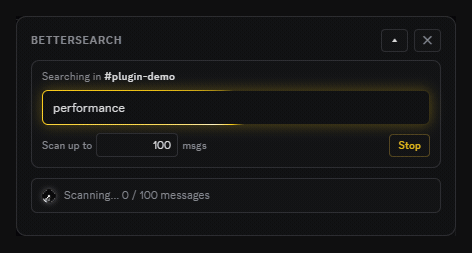
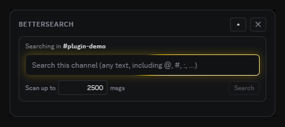
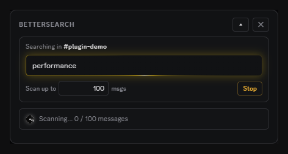
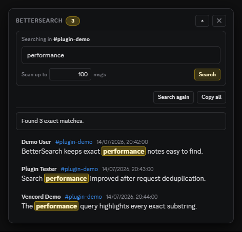

# Vencord: BetterSearch

Exact-substring and symbol search for Vencord. BetterSearch finds message text such as `@`, `#`, file names, email addresses, URLs, and quoted phrases that Discord's native search tokenizer can split or discard.



BetterSearch adds a magnifying-glass control beside Discord's Pinned Messages button. It opens a compact search panel without replacing or modifying Discord's native search.

## Core Behavior

| Feature | What it does | How |
|---|---|---|
| **Exact substring matching** | Finds the requested character sequence anywhere in supported message fields | Normalizes both sides with Unicode NFKC and lowercase matching, then uses an exact `includes` check |
| **Symbol search** | Finds punctuation-heavy text that Discord cannot use as a normal indexed query | Walks recent messages in the currently open channel when no useful text hint exists |
| **Indexed prefilter** | Avoids walking channel history when the query contains searchable text | Sends the longest tokenizable run to Discord's guild or channel search endpoint, then filters candidates locally |
| **Read-only results** | Displays matching messages without modifying them | Uses Discord GET endpoints only and jumps to a message when its result row is activated |
| **Bounded scanning** | Limits request rate, pages, scanned messages, wall time, and displayed matches | Uses validated settings plus one serialized request queue |
| **Duplicate filtering** | Prevents the same search-context message from appearing repeatedly | Deduplicates candidates by channel ID and message ID before counting or matching them |

## Screenshots

### Ready



### Searching



### Results



## Requirements

- A working [Vencord](https://vencord.dev) development setup
- Discord desktop
- `pnpm`, as used by Vencord

## Install

1. Set up [Vencord](https://vencord.dev) if you have not already.
2. Place this repository at `src/userplugins/betterSearch/` inside the Vencord checkout. You can copy the folder or clone it from the Vencord root:

```bash
git clone https://github.com/saintordevil/betterSearch.git src/userplugins/betterSearch
```

3. Rebuild Vencord from the Vencord root:

```bash
pnpm build
```

4. Enable **BetterSearch** in Discord Settings > Vencord > Plugins.

## Usage

1. Open a Discord channel or DM.
2. Click the BetterSearch magnifying glass beside **Pinned Messages**.
3. Enter the exact text to find. Quotes are optional; matching outer double quotes are removed before matching.
4. Set **Scan up to** if you want a smaller or larger live message limit.
5. Press **Search** or Enter.
6. Activate a result to jump to that message.

### Controls

| Control | Behavior |
|---|---|
| **Search** | Starts a new exact-substring search in the displayed scope |
| **Stop** | Cancels the active session and prevents its queued requests from starting |
| **Scan up to** | Changes the live scan limit from 100 to 5,000 messages, including an active session |
| **Search again** | Repeats the last completed, capped, failed, or stopped search with the current limit |
| **Copy all** | Copies the author, channel, timestamp, content, embed text, and attachment names for the current results to the clipboard |
| **Collapse / expand** | Hides or restores the panel body without discarding its state |
| **Close** | Stops the active session, clears the panel state, and returns focus to the toolbar control |

## Search Scope

- In a server, a query with a usable text hint asks Discord's guild search index for candidates, then applies exact matching locally.
- In a DM or group DM, hinted queries use that channel's search endpoint.
- A pure-symbol query such as `@` has no usable index hint, so BetterSearch walks recent history from the currently open channel only.
- BetterSearch never searches across multiple servers.

## What Is Matched

BetterSearch checks:

- message content
- embed titles
- embed descriptions
- attachment file names

It intentionally does not match author names, reactions, component labels, or arbitrary attachment contents.

## Limits and Rate Handling

BetterSearch uses conservative, validated limits:

| Limit | Default | Allowed range |
|---|---:|---:|
| Minimum interval between request starts | 1,100 ms | 800 to 5,000 ms |
| Pages per session | 25 | 1 to 40 |
| Messages scanned per session | 2,500 | 100 to 5,000 |
| Exact matches retained per session | 500 | Fixed |
| Session wall time | 60 seconds | Fixed |

All numeric plugin settings are clamped and rounded when read, so malformed stored values cannot remove the safety bounds.

Requests are serialized, with only one BetterSearch request in flight at a time. Discord REST automatic retries are disabled for these calls. BetterSearch handles failures itself:

- A `429` pauses the shared queue for Discord's `retry_after` value plus a 250 ms safety buffer, then retries the same page if the session is still active and within its wall-time limit.
- Other non-success responses use a 1.5 second soft pause and retry the same page. Three consecutive failures end the session with a visible error.
- Successful responses reset the consecutive-failure counter.
- A stopped or replaced session is checked before and after queue waits, so stale queued work does not start another request. A response already in flight is ignored after cancellation.

BetterSearch deduplicates message candidates, not identical HTTP requests. It does not fan requests out in parallel or coalesce separate user-initiated searches.

## Settings

| Setting | Default | Description |
|---|---:|---|
| `minRequestIntervalMs` | `1100` | Minimum interval between BetterSearch request starts, clamped to 800 to 5,000 ms |
| `maxPages` | `25` | Hard page cap for each session, clamped to 1 to 40 |
| `maxMessagesScanned` | `2500` | Startup scan target, clamped to 100 to 5,000 messages |
| `showPartialBanner` | `true` | Shows why a session stopped when a cap was reached |
| `debugLogs` | `false` | Enables prefixed BetterSearch console diagnostics |

The panel's **Scan up to** field is a live session control. The plugin setting supplies its initial value when BetterSearch starts.

## Privacy and Safety

BetterSearch is read-only:

- It never sends, edits, deletes, reacts to, or acknowledges messages.
- It calls only Discord's guild message search, channel message search, and channel message history GET endpoints.
- Requests use Vencord's webpack-exposed `RestAPI`, which follows Discord's normal authenticated client path.
- It does not read tokens, cookies, browser storage, authorization headers, or Discord settings files.
- It does not use direct `fetch`, external APIs, analytics, update checks, or telemetry.
- **Copy all** runs only after a user click and writes the visible result set to the local clipboard.

## Accessibility

- The toolbar control exposes its expanded state and associated panel.
- The panel is an explicitly labelled region, and the query input has an accessible label.
- Search progress uses polite live status updates, while errors use an assertive alert.
- Result rows support mouse activation, Enter, and Space.
- Escape closes the panel and focus returns to the BetterSearch toolbar control.
- Collapse and expand controls expose their current state.
- Focus-visible outlines are provided for keyboard navigation.
- The scanning orb and decorative focus animations respect reduced-motion preferences.

## Limitations

- Discord's internal search index determines which hinted candidates are available. Missing or not-yet-indexed messages cannot be recovered through the hinted path.
- Pure-symbol fallback is limited to recent history in the currently open channel and stops at the configured caps.
- The toolbar insertion currently anchors to Discord's English **Pinned Messages** accessibility label. A Discord markup or localization change can require an update.
- Discord's private client modules and endpoints can change without notice.
- Results are exact substrings after Unicode normalization and lowercasing, not regular expressions or whole-word matches.
- A session stops when the first applicable page, message, match, or wall-time cap is reached. A partial-results banner explains the reason unless disabled.

## Repository Layout

| Path | Purpose |
|---|---|
| `index.tsx` | Plugin metadata, settings, toolbar injection, panel lifecycle, and search-session wiring |
| `search.ts` | Query preparation, read-only HTTP wrapper, limiter, retries, cancellation, deduplication, and scanning |
| `components.tsx` | Search controls, status UI, result rows, highlighting, copying, and accessibility behavior |
| `orb.tsx` | Decorative WebGL scanning indicator with reduced-motion support |
| `style.css` | Scoped toolbar, panel, result, focus, and theme-aware styles |
| `assets/` | README screenshots and animated scan preview |

## Author

Created and maintained by [saintordevil](https://github.com/saintordevil).

## License

BetterSearch is licensed under the [GNU General Public License v3.0 or later](LICENSE), consistent with its Vencord source headers.
