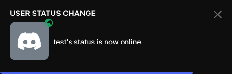

# NotifyUserChanges

Adds a notify option in the user context menu to get notified when a user changes voice channels or online status

I will not add more features to this plugin. If you're insane you can try https://github.com/zastlx/vc-stalker-plugin

# Installation
See [here](https://github.com/D3SOX/vencord-userplugins#install) and the [Vencord docs for installing custom plugins](https://docs.vencord.dev/installing/custom-plugins/)
