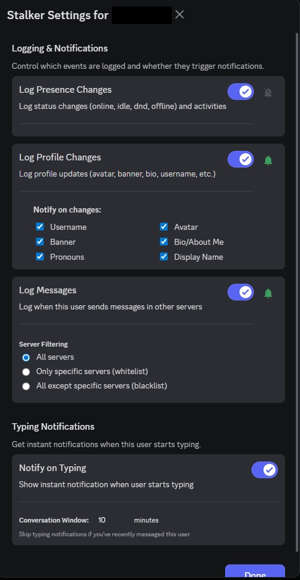
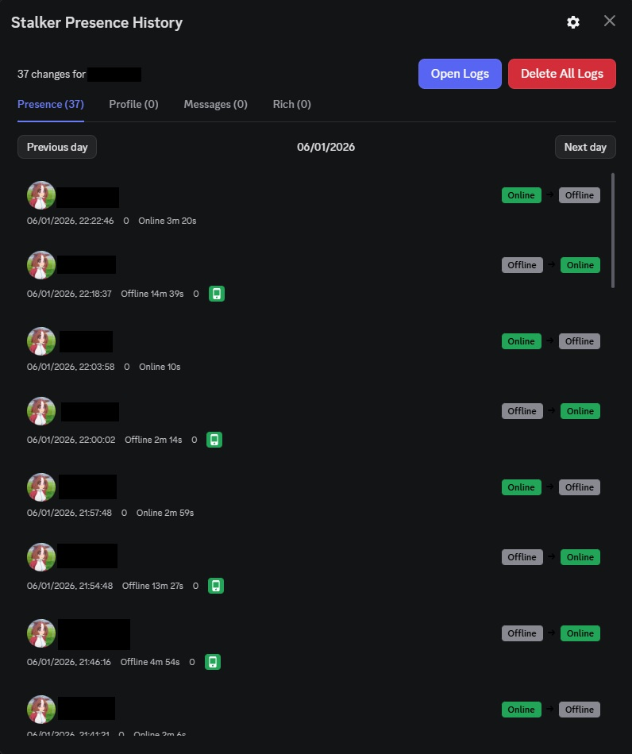
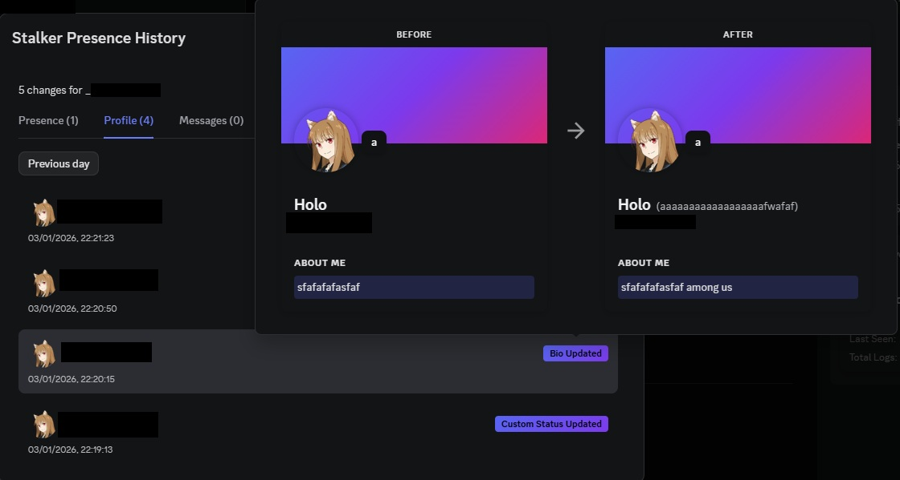
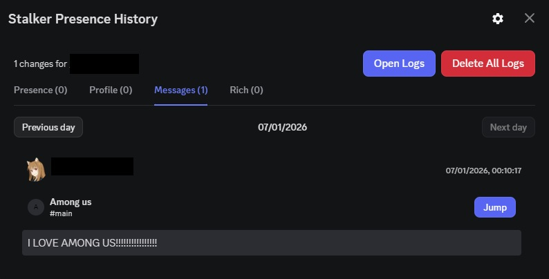
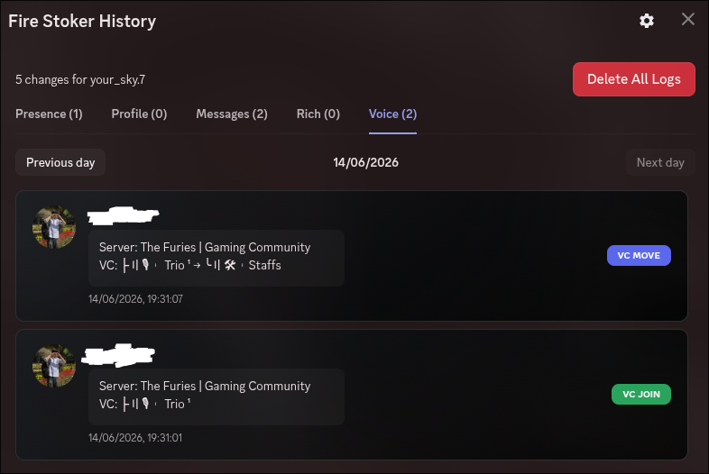

# Vencord Fire Stoker

Advanced Discord tracking plugin for Vencord featuring presence history, voice activity monitoring, profile snapshots, activity tracking, message logging, and detailed user analytics.

## Features

* Presence & status tracking
* Rich Presence logging
* Voice channel join / leave / move tracking
* Profile change detection
* Message logging
* Typing notifications
* User activity analytics
* Per-user tracking settings
* Local history storage
* Profile snapshots

## Installation

Follow the official Vencord Custom Plugins Guide:

https://docs.vencord.dev/installing/custom-plugins/

Or watch the installation tutorial:

https://youtu.be/XmVNRKrphlw

## Usage

1. Right-click a user.
2. Select **Track With Fire Stoker**.
3. Open **Fire Stoker History**.
4. Configure tracking options in plugin settings.

## Screenshots

### Settings

### Presence History

### Rich Presence

### Profile Tracking

### Message Logs

### Voice Logs

## Author

**Fire Shot**

## Repository

**vencord-fire-stoker**

## Credits

Original concept inspired by the Vencord Stalker / Activity Tracker plugin.

Extended with:

* Voice Tracking
* Activity Analytics
* Enhanced UI
* Profile Snapshot System
* Fire Stoker Branding

## Disclaimer

This project is intended for educational and personal use. Users are responsible for complying with Discord's Terms of Service and applicable laws.

## License

This project is licensed under the MIT License.

Copyright © 2025 (Fire Shot)

